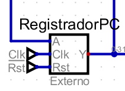
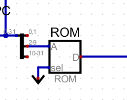
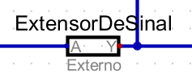
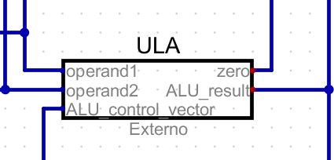
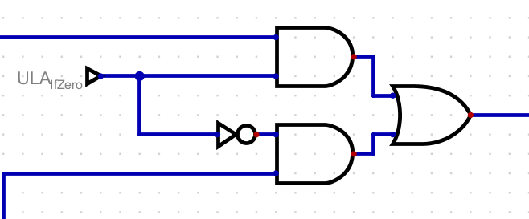
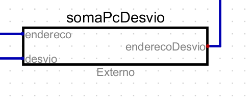
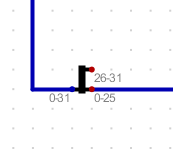
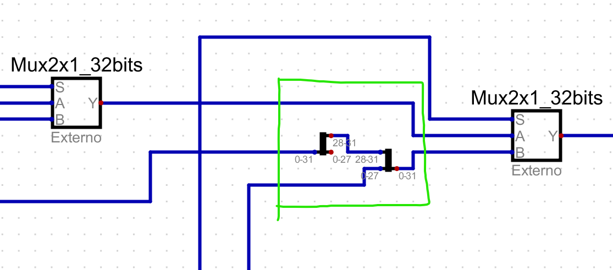
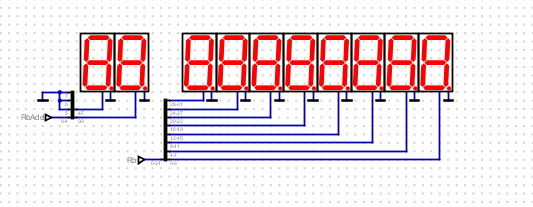

Esse documento tem como o intuito explicar como o processador feito funciona, falando sobre cada módulo e tudo mais.

**Esses 3 componentes explicam como a instrução é passada ao processador e como novas instruções são carregadas a cada ciclo de clock, além de mostrar como instruções posteriores são carregadas**

### REGISTRADOR PC

### ROM

### SOMA 4

**Esses componentes mostram boa parte da estrutura do processador, mostrando como ele pode realizar cálculos e salvar dados nos registradores e RAM, além de conseguir resgatar esses valores para colocar no registradores**

### CONTROL

### SEPARADOR DE BITS DE INSTRUÇÕES

### EXTENSOR DE SINAL

### MUX DE REGISTRADOR QUE VAI TER DADOS ESCRITOS

### BANCO DE REGISTRADORES

### ALU CONTROL (ULA CONTROL)

### ULA

### MUX DE SEGUNDO OPERANDO

### RAM

### MUX DE DADO QUE DEVE SER ESCRITO

**Esses componentes mostram como funciona a estrutura de Desvio, permitindo que o programa possa ir para determinados espaços de memória onde estão as instruções requisitadas, como BNE, BEQ e Jump**

### PORTAS LÓGICAS DE BNE E BEQ

### SOMA PC DESVIO

### MUX DE DESVIO DE ENDEREÇO

### SEPARADOR DE BITS DE ENDEREÇO

### SHIFT LEFT DE 2 BITS

### ESTRUTURA PARA CRIAR NOVO ENDEREÇO

### MUX DE JUMP

**Esses dois componentes servem para ajudar o aluno a debugar melhor o processador e entender como os dados estão sendo usados e quais registradores possuem quais valor**

### DISPLAY DE DEBUG

### CONTROLE DO PROCESSADOR

