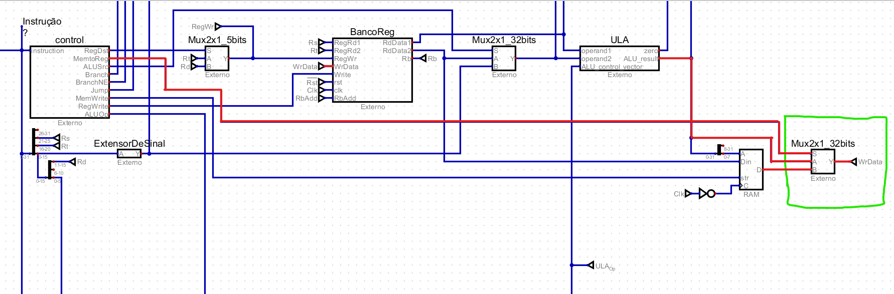

Esse documento tem como o intuito explicar como o processador feito funciona, falando sobre cada módulo e tudo mais.

**Observações importantes e algumas dicas para entender melhor**: 

1º -> Muitos sinais (bits, bytes, etc) do processador são enviados de forma "Se precisar usar, já ta lá" / "Envia o dado, se for usar ou não". Isso é importante de ser entendido, pois pode gerar confusão. Um exemplo que será falado posteriomente é o do "Zero" da ULA, que so serve para o BNE e BEQ, onde esse dado é enviado de qualquer forma mesmo não recebendo uma instrução para fazer um Branch.

## Componentes de controle de instruções

### REGISTRADOR PC (3 Entradas, 1 Saída)

Esse componente serve para registrar em qual posição da memória deve ler uma determinada instrução. Resumidamente, é ela que "diz" qual instrução é a próxima a ser lida.

***A (32 bits)*** -> Endereço da instrução que será lida
***Clk (1 bit)*** -> Clock do processador
***Rst (1 bit)*** -> Reset do registrador, responsável por retornar ao endereço 0

### ROM (2 Entradas, 1 Saída)

Componente de memória ROM. Você pode carregar o programa em Intel HEX aqui, vindo do MARS por exemplo, contendo as instruções do seu programa.

***A (8 Bits)***
***Sel (8 Bits)***

***D (32 Bits)*** -> Instrução apontada pela entrada "A"

### SOMA 4 (1 Entrada, 1 Saída)

Esse componente é simples, ele recebe um endereço e soma +4 a ele. Isso serve para "Avançar" o endereço que deverá ser lido pela ROM. 

***A (32 bits)*** -> Endereço do RegistradorPC
***Y (32 bits)*** -> Endereço recebido com +4 (Esse endereço normalmente volta para o Registrador PC, como entrada)

OBS: No processador por padrão (Caso não aconteça desvios), seu dado chega ao RegistradorPC, informando dessa forma que a próxima palavra deve ser lida, dando o seu endereço. Ou seja, ele normalmente dá o dado que chega no `A` do RegistradorPC, e o `Y` do RegistradorPC é o `A` do Soma4, formando assim um ciclo de "Avançar as instruções". No final do documento, será explicado a estrutura de desvio.

## Componentes de controle e realização de tarefas do processador

**Esses componentes mostram boa parte da estrutura do processador, mostrando como ele pode realizar cálculos e salvar dados nos registradores e RAM, além de conseguir resgatar esses valores para colocar no registradores. Antes de avançar, é importante sabe a estrutura das instruções que o processador recebe, e seus diferentes tipo (R, I e J), pois isso é importante para diversos módulos que serão explicados! (Lembrando que todas as instruções carregam 32 bits)**

**R-Type** -> Como podemos ver pela estrutura, ela carrega o OPCode da instrução e também as informações dos 3 registradores, sendo eles:

**rs** -> 1º Operando
**rt** -> 2º Operando
**rd** -> Registrador de Destino

Por exemplo, se temos a instrução tipo R ``ADD $t1, $t2, $t3``, teriamos a seguinte estrutura:

**OpCode** = ``ADD``
**rs** = ``$t2``
**rt** = ``$t3``
**rd** = ``$t1``

*"Coloque dentro de ``$t1`` a soma de ``$t2`` com ``$t3``"*

O ``shamt`` e ``funct`` não serão totalmente explicados, mas o ``funct`` em algumas operações (No tipo R por exemplo), serve para dizer qual operação deve ser feita. (Lembre-se do "O processador envia, se vai usar ou não, ai é outra história")

**I-Type** -> Essas são operações que utilizam campo imediato, ou seja, um dado diretamente. Um exemplo é `ADDI $t1, $t2, 10`. Perceba que não temos um terceiro registrador servido de 2º operando, e sim um campo imediato chamado de `imm`.

Outra característica desse tipo de instrução é o fato do `$rt` ser usado como Registrador de Destino. Então, na instrução dita mais acima, a estrutura ficaria da seguinte forma:

**OpCode** = ``ADDI``
**rs** = ``$t2``
**rt** = ``$t1``
**imm** = ``10``

*"Coloque dentro de `$t1` a soma de `$t2` com 10"*

**J-Type** -> Instruções de desvio, como JUMP por exemplo. Essa instrução tem apenas o OPCode e o endereço de desvio. Perceba que o endereço de desvio tem apenas 26 bits, sendo necessário algumas operações no dado antes que eles sejam usados como endereço no RegistradorPC por exemplo, já que um endereço possui 32 bits.

<strong>Dito isso, vamos aos componentes!</strong>

### CONTROL (1 Entrada, 9 Saídas)

Basicamente o cérebro do processador, esse componente é responsável por receber a instrução que deverá ser executada, retornando os devidos sinais para o restante dos módulos, informando oque eles devem fazer e oque deve ser executado. Boa parte das saídas são de apenas 1 bit, apenas para "sinalizar" alguma parte do restante do processador.

***Instruction (32 bits)*** -> Instrução recebida da ROM

**RegDST (1 bit)** -> *Usada em conjunto com um MUX*. Serve para informar qual é o registrador que será usado na escrita, escolhendo entre o `$rt` ou `$rd`. 

**MemToReg (1 bit)** -> *Usada em conjunto com um Mux*. Diz se um determinado dado deve ser resgatado da RAM ou não. Uma operação de LW (Load Word) é um exemplo onde isso é usado.

**ALUSrc (1 bit)** -> *Usada em conjunto com um Mux*. Serve para dizer se o 2º operando que será usado na ULA deve ser o `imm` ou o ``$rt`` da instrução.

**Branch (1 bit)** -> Diz se nesse ciclo de clock terá um Branch do tipo BEQ.(Melhor explicado na seção de Controle e Desvio)

**BranchNE (1 bit)** -> Diz se nesse ciclo de clock terá um Branch do tipo BNE.(Melhor explicado na seção de Controle e Desvio)

**Jump (1 bit)** -> Diz se nesse ciclo de clock terá um Jump. (Melhor explicado na seção de Controle e Desvio)

**MemWrite (1 bit)** -> Informa se um determinado dado deve se salvo na RAM. Uma operação de SW (Store Word) é um exemplo onde isso é usado.

**RegWrite (1 bit)** -> Diz se nesse ciclo de clock terá uma escrita em algum registrador.

**ALUOp (2 bits)** -> Serve para informar a ALU_Control qual operação precisa ser feita.

### SEPARADOR DE BITS DE INSTRUÇÕES (Organização)

Essa estrutura serve para melhorar o acesso as informações da instrução, utilizando túneis e pontes para melhorar isso. Ele recebe os 32 bits da instrução e "destrincha" ela, pegando alguns dados importantes e deixando eles de fácil acesso através dos túneis, como o `$rs`, `$rt` e `$rd` por exemplo. De forma resumida, é isso.

### EXTENSOR DE SINAL (1 Entrada, 1 Saída)

Simples, esse componente serve para pegar uma entrada de 16 bits e converte-la para 32 bits. Isso pode ser usado para muitas coisas, desde extender algum dado ou até mesmo converter o dado que vem do `imm` para 32 bits.

**A (16 bits)** -> Dado com 16 bits
**Y (32 bits)** -> Dado modificado com 32 bits

### BANCO DE REGISTRADORES (9 Entradas, 3 Saídas)

Esse componente armazena todos os registradores do sistema, podendo resgatar e gravar informações neles.

**RegRd1 (5 bits)** -> Registrador `$rs` (Normalmente o 1º Operando)
**RegRd2 (5 bits)** -> Registrador `$rt` (Normalmente o 2º Operando)
**RegWr (5 bits)** -> Registrador que vai ter dados escritos (Normalmente o Registrador de Destino)
**WrData (32 bits)** -> Dado que vai ser escrito em um dos registradores.
**Write (1 bit)** -> Sinal que informa que nesse ciclo de clock vai ter Escrita.
**rst (1 bit)** -> Sinal que informa um Reset nos dados dos registradores
**clk (1 bit)** -> Sinal de Clock
**RbAdd (5 bits)** -> **(Debug)** Serve para dizer qual registrador vai ter dados lidos, ajudando no sistema de Debug explicado na seção de Debug.

**RdData1 (32 bits)** -> Dado do `$rs` requisitado
**RdData2 (32 bits)** -> Dado do `$rt` requisitado
**Rb (32 bits)** -> **(Debug)** Dado requisitado da entrada `RbAdd`, indo para o display, ajudando no sistema de Debug explicado na seção de Debug.

### MUX DE REGISTRADOR QUE VAI TER DADOS ESCRITOS

Aqui chegamos a primeira imagem desse tipo! Perceba que é uma imagem que mostra como um determinado componente ou estrutura se comunica com outra. Nesse caso, estou mostrando como `RegDST` do Control pode selecionar o registrador que vai ter dados escritos. Esse sinal é reponsável por dizer se o `RegWr` do BancoReg será o campo `$rt` ou `$rd` da instrução.

### ALU CONTROL (ULA CONTROL) (2 Entradas, 1 Saída)

Esse componente é responsável por selecionar qual operação deverá ser feita na ULA, uma soma, subtração, AND, OR e etc.

**ALUOp (2 bits)** -> Operação que precisa ser executada.
**Funct (6 bits)** -> Campo `funct` da instrução, mais comum nas instruções do tipo R

**Alu_Control_Vector (4 bits)** -> Opera ção que deve ser executada na ULA 

### ULA

O matemático do processador! Esse componente é responsável por fazer os cálculos necessários do processador, pegando 2 dados e 1 operação e retornando o resultado.

**Operand 1 (32 bits)** -> Primeiro operando
**Operand 2 (32 bits)** -> Segundo operando
**Alu_Control_Vector (4 bits)** -> Operação que deve ser feita

**ALU_Result (32 bits)** -> Resultado da operação
**Zero (1 bit)** -> Sinal que informa se a operação retornou 0 (Útil para as operações de Desvio como BNE e BEQ)

Abaixo está um exemplo das entradas:

14 + 4

*14* = `1º Operando`
*4* = `2º Operando`
*+* = `Operação` (Em binário seria 0010)

### MUX DE SEGUNDO OPERANDO

Essa estrutura é responsável por selecionar qual vai ser o segundo operado a ser utilizado pela ULA. Podemos ver que o `ALUSrc` controla o MUX, selecionando se vai ser o `RdData2`, no caso o `$rt` **(R-TYPE Instructions)**, ou o campo imediato `imm` resgatado do extensor de sinal **(I-TYPE Instructions)**.

### RAM (4 Entradas, 1 Saída)

Simples, um lugar onde dados podem ser guardados e resgatados. Normalmente operações de SW e LW mexem aqui.

**A (8 bits)**
**Din (32 bits)**
**str (1 bit)**
**C (1 bit)**

**D (8 bits)**

### MUX DE DADO QUE DEVE SER ESCRITO

Essa estruturas é responsável por dizer se o dado que vai ser escrito no registrador é um dado que vem da RAM ou o dado que vem da ULA, no caso, o seu resultado. O `MemToReg` é responsável por controlar isso.

## Componentes e estruturas de controle de desvios
**Esses componentes mostram como funciona a estrutura de Desvio, permitindo que o programa possa ir para determinados espaços de memória onde estão as instruções requisitadas, como BNE, BEQ e Jump**

### PORTAS LÓGICAS DE BNE E BEQ

Essas portas são responsáveis por dar um sinal de que deve haver um desvio, sendo esse sinal a saída da porta OR. Perceba que tem dois AND's, os dois recebem o sinal da ULA se o resultado dela foi Zero. O mais acima representa o BEQ, onde caso tenha sido zero e o Control deu um sinal de `Branch`, então tem um desvio. O mais abaixo representa o BNE, onde caso não tenha sido zero e o Control deu um sinal de `BranchNE`, então tem um desvio. 

Resumindo, essa estrutura também controla o BEQ e BNE.

### SOMA PC DESVIO (2 Entradas, 1 Saída)

Basicamente esse componente recebe o próximo endereço e um desvio que precisa ser feito, retornando um endereço com desvio.

**Endereço (32 bits)**
**Desvio (32 bits)**

**EndereçoDesvio (32 bits)**

### MUX DE DESVIO DE ENDEREÇO DE BNE ou BEQ

Essa é a primeira estrutura de decisão. O MUX recebe dois dados, sendo esses o próximo endereço, que é do Soma4, e um endereço desviado, vindo do SomaPcDesvio. O dado que avança desse MUX é a da estrutura de portas lógicas que controla o BNE e BEQ, caso uma delas seja verdadeira, o MUX passa o dado presente no SomaPcDesvio, se não, ele apenas passa o próximo endereço do programa.

### SEPARADOR DE BITS DE ENDEREÇO

Falamos sobre como o BNE e BEQ funciona, agora vamos falar sobre o Jump. Como vimos no começo do arquivo, temos que as intruções do tipo **J-TYPE** tem um OpCode e o endereço, mas esse endereço tem apenas 26 bits, sendo que um endereço deve ter 32 bits. Para resolver isso, temos que fazer alguns processos e estruturas que serão discutidas mais abaixo.

### SHIFT LEFT DE 2 BITS (1 Entrada, 1 Saída)

Esse componente serve para pegar um endereço de 26 bits e converte-lo para 28 bits, realizando um Shift Left de 2 Bits.

**Addr26 (26 bits)** -> Endereço de 26 bits

**Addr28 (28 bits)** -> Endereço resultante de 28 bits

### ESTRUTURA PARA CRIAR NOVO ENDEREÇO JUMP

Essa estrutura é responsável por pegar o endereço da instrução `Jump` que sai do ShiftLeft2 (28 bits) e preparar ela para ter 32 bits. Perceba que pegamos os 28 bits resultantes e juntamos ela com 4 bits, assim formando 32 bits. Esses 4 bits vem do Soma4, onde entra na ponte mais acima, sendo destrinchada em duas saídas, uma de 28 bits e outra de 4 bits, onde esses 4 bits são unidos com os 28 bits do ShiftLeft2, assim se tornando 32 bits.

Resumindo: A ponte mais acima recebe os 32 bits do Soma4 e pega apenas os 4 bits mais a esquerda. A ponte mais abaixo pega o endereço do Jump que sai do ShiftLeft2 e esses 4 bits, juntando eles, assim tendo uma saida de 32 bits, sendo o endereço de desvio do `Jump`.

### MUX DE DESVIO FINAL

Essa estrutura é a responsável por dar o endereço da instrução que deve ser resgatada no próximo ciclo de clock. O MUX tem duas entradas, sendo elas a saída do MUX anterior, que decide se deve pegar o endereço do Soma4 ou do SomaPcDesvio, e a saída do Endereço do Jump. O seletor `S` deve decidir se o próximo endereço de instrução é o que vem do Jump ou do MUX anterior, que pode ser o Soma4 ou SomaPcDesvio. A saída desse Mux vai para o RegistradorPC. O dado que seleciona qual dos dois deve ser enviado é a saída `Jump` do Control.

*OBS: Também dá para fazer apenas um MUX 3x1, que decide quais dos 3 valores devem ser a saída, mas dessa forma também funciona e não muda muito a estrutura do processador e do ControL, e também considero ela mais simples de ser implementada.*

## Componentes de Debug do Processador

**Esses dois componentes servem para ajudar o aluno a debugar melhor o processador e entender como os dados estão sendo usados e quais registradores possuem quais valores.**

### DISPLAY DE DEBUG

Esse Display tem 2 conjunto de displays, sendo o mais a esquerda responsável por mostrar o registrador que está sendo debugado, e o display mais a direta para dizer qual o valor desse registrador. Bem simples.

### CONTROLE DO PROCESSADOR

Aqui é onde você controla os ciclos e reset do processador. 

**CLK** -> Ciclo de Clock do processador, apertando no botão o Ciclo é feito.

**~HALT** -> Pausa o processador, onde os próximos ciclos não serão computados (Deve estar ativo para o Clock funcionar)

**~RST** -> Serve para resetar o processador, como registradores e programa. (Deve estar ativo para o Clock funcionar)

Podemos ver também que tem o `RbAdd` que recebe uma entrada de 5 Bits do usuário, informando qual registrador deve ser debugado no Display de Debug.

